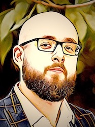

# Sergey Bershadsky

    IT professional, Backend, DevOps engineer, and team mentor.

* DOB 10/08/1985
* Moscow, Russian Federation / Tel-Aviv, Israel
* [LinkedIn](https://linkedin.com/in/bershadsky)
* [Facebook](https://www.facebook.com/sergio.bershadsky)       
* **Target position:** `VPE, CTO, LA, LD`                    

    I am an experienced architect, backend developer, and team leader.
    I have worked as a frontend developer in the past, and even as a designer and musician. 
    Lately, I've done a lot of DevOps and tech-related mentoring. 
    I offer flexible cloud infrastructure auto-testing and CI, boosting team productivity. 
    My life motto is to not be afraid to face new IT challenges.

## Timeline

### 2016 - present: DevOps and Core Developer

**[toptal.com](https://toptal.com): Top 3% of Freelance Talent.**

Developed dozens of projects for TopTal clients. Full list is subject to NDA.  
[Toptal's Profile](https://www.toptal.com/resume/sergey-nikitin)

**Technologies:** `Linux, AWS, Google Cloud, Ansible, Terraform, Docker, Kubernets, Go, Python, Django, PostgreSQL, ElasticSearch, Graylog, Grafana, ZeroMQ, JSON-RPC, JSON-RPC over websockets, API-Gateway, iOS, Vue.js`

### 2018 - 2019: Lead Backend, Lead Architect

**[Play2Live](https://play2live.io): Blockchain streaming platform startup.** 

This was one of my most challenging projects to date. 
Our goal was to create a brand new streaming platform with a blockchain financial layer and artificial intelligence on video streams. 
I was responsible for leading a team of 20 backend developers and making core technology choices.
The first MVP was built on Django and [raises 30 million US dollars](https://icorating.com/ico/play2live/) in ICO (BTC, ETH-equivalent). 
The blockchain app was built on top of BitShares’ network and did not include an AI layer. 
The second MVP was built on Django, pure python and C/C++ technologies. 
We built a streaming service, artificial intelligence layer in C/C++, dozens of backend API's, and self-developed an API gateway using the JSON-RPC protocol. 
We also implemented a private blockchain network and apps on top of the Tendermint technology. 
I was responsible for organizing the development process, technology choices, and the API-gateway development. 
All infrastructure was run on AWS and Google Cloud. Most work was done remotely.

> On-boarding entry on the [medium](https://medium.com/play2live-development-blog/play2live-senior-backend-developer-serg-bershadsky-f7c7e0a035c5)

**Technologies:** `Linux, AWS, Google Cloud, Ansible, Terraform, Docker, Kubernets, Go, Python, C++, Django, PostgreSQL, ElasticSearch, Graylog, Grafana, ZeroMQ, JSON-RPC, JSON-RPC over websockets, API-Gateway, iOS, Vue.js`

### 2016 - 2018: Lead Backend, Lead Architect

**[emias.info](https://emias.info): UMIAS.**

One of the most remarkable projects for me was participating as lead architect developer in the Moscow Medicare project UMIAS. 
My team built the appointment frontend system for more than 670 clinics in Moscow. 
This is a big project with more than 300 developers. 
Our area of responsibility was the development of web and mobile applications both for iOS and Android. 
The backend was written with python, web app - ReactJS and mobile app - ReactNative. 
Also, we implemented a chatbot in Telegram messenger. 
My tasks included the backend development on Linux bare-metal using Ansible and Jenkins as IaC and CI/CD tools. 
I used certified medicare protocols and specifications in the application development, such as OpenEHR and HL7. 
During the three years that I was part of the project, I developed about 40 sub-projects related to the UMIAS appointment system and infrastructure. 
Today, this system handles more than 1,500,000 appointments per month and 30,000 patients per day.

**Technologies:** `Linux, Bare-metal, Ansible, Docker, Kubernets, Go, Python, Django, MySQL, PgSQL, Elastic, Logstash, Grafana, ZeroMQ, iOS, Android, React Native, JSON-RPC, SOAP, React.js`

### 2013 - 2015: Lead Architect, Lead Developer

**Nasimke: Mobile Social Network MVP.**

Created more than forty social features. 
Developed a fast messaging system handling 1 billion user messages. 
Built a Twitter-like following feature using a custom incremental indexing system. 
Created a file uploading feature by file conversion using FFmpeg and ImageMagick. 
Stored every file uploaded by users in different formats. 
Developed SMS and e-mail messaging functionality using Django/Celery. 
Implemented silent two-phase deployment (supervisor with nginx) so that users don't notice when the site updates. 
Handled 2.5 million registered users with 15,000 users online each evening. 
Generated around 60 TB of user file data stored.

**Technologies:** `Linux, Bare-metal, Python, Flask, MySQL, Redis, FFmpeg, ImageMagick`

### 2011 - 2013: Lead Architect, Lead Developer

**MobFerma: Online-gaming startup.**

Developed time-manager, farm-like game. Managed 4-member team (game designer, art designer, backend developer, and frontend developer). 
Created a fast REST protocol and implemented game logic. 
Created around 200 REST nodes as a result, with twenty functional elements per node. 
Created a REST-oriented gaming solution with two frontends for smartphones and an extremely simple WAP version with basic gaming features. 
Handled a maximum of 10k users at a time, with over 250k users registered in the first three months after launch. 
Used MongoDB and Redis for the main storage. Wrote the backend application server in Python on top of Gevent. 
Built two frontends to work on top of Gevent+Flask. Published the game in popular social networks (VK, Mail, OK) and in a mobile app catalog. 
Implemented many cool social features such as messaging, forum, support, social groups, and game quests among users. 
Included around twenty mini-games such as individual quests, fishing, and tasks related to plants and animals. 
Incorporated around 400 game items created by the art designer.

**Technologies:** `Linux, Bare-metal, Python, Flask, MySQL, MongoDB, Redis, ImageMagick`

### 2009 - 2011: Lead Developer

**Esmeralda: eCommerce startup**

Worked in a team of five developers. 
Implemented core functionality and infrastructure. 
Handled over 250k registered users (around 1k users at any given time). 
Integrated a third-party accounting system 1C Enterprise (Popular in Russia ERP and CRM system) through a RESTful service built on top of Django/TastyPie. 
Created over thirty new Django modules within the project. 
Built thirteen shop views, delivering retail and wholesale product information and a shopping-cart feature, based on a single platform (Django). 
Included authorization for all sites through popular social networks like FB, VK, and more. Implemented a single sign-on (SSO) feature across all sites. 
Implemented a simple CMS page-tree feature, RTE, and functionality for turning pluggable product info directly into the text. 
Implemented all background tasks using the Django/Celery module.

**Technologies:** `Linux, Bare-metal, Python, Django, MySQL, MongoDB, Redis.`

### 2005 - 2009: CEO/CTO

**PRME: Digital Agency**

Self-employed web-developer, expanded into a small web-development company of 10 members, with more than 100 web sites done in 5 years, mostly for government, education, and eCommerce. 
All projects were done using [TYPO3](https://typo3.org) as CMS. 
During this period I became a **[top 5](http://www.typo3.ru/developers/)** TYPO3 developer in the Russian Federation and CIS.

**Technologies:** `Linux, Bare-metal, TYPO3, Apache, PHP, MySQL.`

### 2003 - 2005: Junior, Web-developer

**[X-Project](https://www.xproject.ru): digital agency**

Spent majority of time on frontend web development. 
Did industrial level ruby, adopted for web browsers of those days (IE5.5, IE6, Opera, Firefox) (X)HTML-markup. 
All projects were done for Russian companies such as BAON, VDNH, EBRR, Holodilnik.ru, Accounts Chamber of Russian Federation etc.

**Technologies:** `WIN, HTML, CSS, Apache, PHP, MySQL.`

## Education

* 2001-2003: Ministry of Foreign Affairs - Moscow. Translator's degree in Arabic Languages
* 2003-2005: MSAU - Moscow. Bachelor's degree in Agriculture Engineering and Education
* 2003-2008: Felix school. Guitar teacher degree
* 2005 2010: MSAU - Moscow. Master's degree in Agriculture Management and Economics

## Skills and experience

### OS

* Windows `20 years` 
* Linux `14 years` 
* OSX `3 years` 

### DevOps

* Bare-metal `14 years`
* Docker `7 years`
* AWS `5 years `
* Jenkins `4 years`
* Ansible/Cloudforamtion/Kubectl `3 years`
* GitLab/Bitbucket/CircleCI pipelines `5 years`
* Google Cloud `4 years `

### Programming Languages

* HTML/CSS `17 years`
* JavaScript `16 years`
* Python `10 years`
* PHP `5 years`
* C/C++ `3 years`
* C#  `2 years`
* Java `2 years`
* Golang `1 year`

### Frameworks

* Django `11 years`
* Flask `10 years`
* Angular `3 years`
* ReactJS `2 years`
* ReactNative `2 years`
* YII `3 years`

### Databases

* MySQL `17 years` 
* PgSQL `9 years`
* Redis `8 years`
* MongoDB `6 years`
* CouchDB `3 years`
* ElasticSearch `4 years`

### Software

* Jetbrain's stack
* JIRA/Slack/Redmine
* Docker/K8S
* Git/Github/Bitbucket/Gitlab/
* Ansible/Terraform/Cloudformation

## Languages

* ★★★★★ Russian (Native) 
* ★★★★☆ English
* ★★☆☆☆ Hebrew
* ★☆☆☆☆ Arabic 
 

## Certificates

* 2015 - Web Security
* 2016 - Developing Highload application
* 2016 - Developing Medical Software with OpenEHR 
 

## Interests

* Computer science
* Snowboarding
* Music
* Travelling
* Biking
